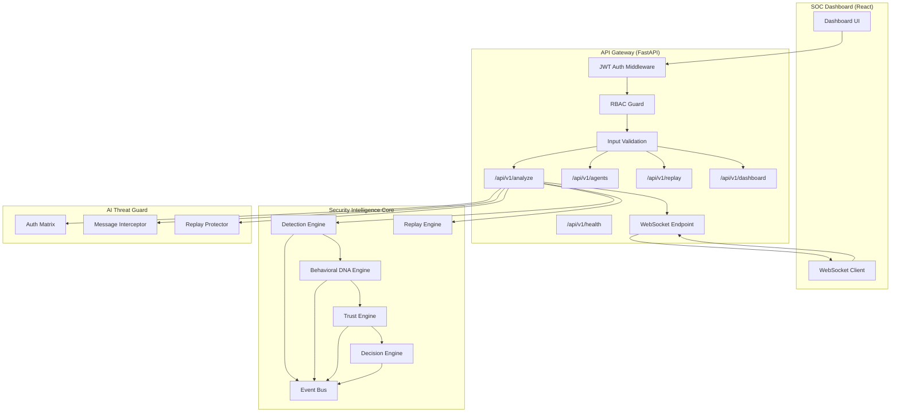
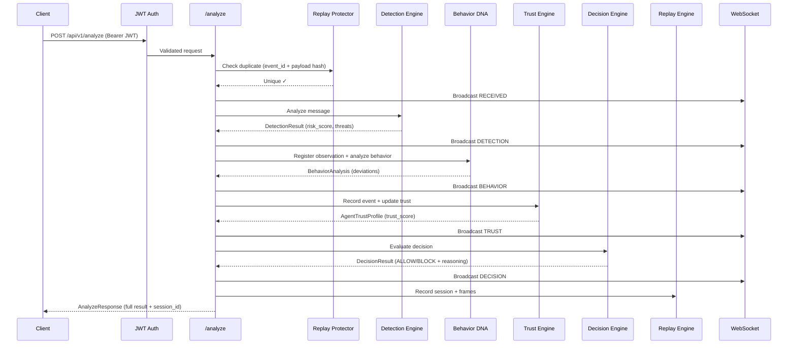

<div align="center">

# 🛡️ AgentShield X

### AI-to-AI Security Intelligence Platform

**Detect. Profile. Decide. Replay.**

Real-time threat detection, behavioral DNA fingerprinting, dynamic trust scoring, and explainable security decisions for multi-agent AI systems.

[]()
[](LICENSE)
[]()
[]()
[]()
[]()
[]()

</div>

---

## 🔍 Overview

As AI agents become autonomous participants in enterprise workflows — calling tools, making decisions, and communicating with other agents — the attack surface expands beyond traditional application security.

**AgentShield X** is a security intelligence platform purpose-built for this new threat landscape. It sits between AI agents in multi-agent systems, intercepting every interaction and running it through a four-stage security pipeline:

1. **Detection** — Pattern-match against 20+ threat signatures (prompt injection, command injection, data exfiltration)
2. **Behavioral DNA** — Build a statistical fingerprint of each agent's normal behavior and detect deviations
3. **Trust Scoring** — Maintain a dynamic, weighted trust score per agent that evolves with every interaction
4. **Decision** — Combine all intelligence signals into an explainable ALLOW / MONITOR / BLOCK / QUARANTINE decision

Every interaction is recorded as a replayable timeline, enabling security analysts to investigate incidents frame-by-frame through the SOC dashboard.

---

## ⚡ Key Features

### 🔬 Detection Intelligence
Pattern-matching engine with 20+ compiled regex rules across 6 threat categories: prompt injection, command injection, data exfiltration, social engineering, privilege escalation, and evasion techniques. Severity-weighted risk scoring with normalized output.

### 🧬 Behavioral DNA Engine
Builds a unique behavioral fingerprint for each AI agent based on tool usage patterns, message length distributions, request intervals, and risk score baselines. Detects anomalous behavior by measuring statistical deviation from the established DNA profile, with cold-start protection and poisoning resistance.

### 🏛️ Trust Intelligence
Dynamic, composite trust scoring using a weighted formula (40% history momentum, 35% behavioral score, 25% policy compliance). Includes trust poisoning rate-limiting — positive trust accumulation is capped at +0.05 per event to prevent trust farming attacks.

### ⚖️ Decision Intelligence
Multi-factor decision engine that synthesizes detection results, behavioral analysis, trust scores, and policy rules into an explainable security verdict. Produces full reasoning chains with severity grading, reason codes, and actionable recommendations.

### 🔄 Replay Engine
Full forensic reconstruction of every security interaction. Each analysis creates a timestamped session with ordered frames capturing the state at every pipeline stage. Supports session listing, filtering, and detailed timeline retrieval for incident investigation.

### 📡 Security Events
Structured event bus with lifecycle tracking. Events flow through canonical stages (raw → detected → behavior_analyzed → profiled → complete) with immutable enrichment at each stage.

### 🔐 Authentication & RBAC
Custom HS256 JWT implementation with PBKDF2-SHA256 password hashing, refresh token rotation, token revocation, and three-tier Role-Based Access Control (Admin, Security Analyst, Viewer). WebSocket connections require JWT authentication.

### 📊 SOC Dashboard
Real-time operational dashboard with live metrics: active agent count, session statistics, threat/block rates, average trust scores, and the 10 most recent security decisions. WebSocket-powered live pipeline progress updates.

### 🛡️ AI-Specific Protections
Purpose-built defenses against AI-native attack vectors: prompt injection, indirect prompt injection, tool abuse, agent identity spoofing, recursive tool loops, cross-agent contamination, data exfiltration, trust poisoning, and behavioral baseline poisoning.

---

## 🏗️ Architecture

### System Overview



### Request Flow



---

## 🖥️ Screens

| Screen | Description |
|--------|-------------|
| **Command Overview** | Real-time SOC dashboard with live metrics, threat rates, and recent security decisions |
| **Threat Investigation** | Detailed threat analysis with detection results, matched rules, and risk scoring |
| **Replay Timeline** | Frame-by-frame forensic replay of any security interaction through the pipeline |
| **Fleet Status** | Trust profiles for all monitored agents with scores, grades, and trend indicators |
| **Sandbox** | Interactive agent message testing tool for manual threat analysis |
| **Incident Intelligence** | Aggregated incident views with severity classification and response recommendations |

---

## 🛠️ Tech Stack

| Layer | Technology |
|-------|-----------|
| **Backend** | Python 3.11+, FastAPI, Pydantic, Uvicorn |
| **Frontend** | React 18, D3.js, Tailwind CSS, Axios |
| **Security** | Custom HS256 JWT, PBKDF2-SHA256, HMAC, RBAC |
| **Infrastructure** | Docker, Docker Compose |
| **Protocol** | REST (JSON), WebSocket (real-time) |
| **Testing** | pytest, httpx |

---

## 🚀 Quick Start

### Prerequisites
- Docker & Docker Compose **or** Python 3.11+ and Node.js 18+

### Docker (Recommended)

```bash
# Clone the repository
git clone https://github.com/Ankit2429/AgentShield.git
cd AgentShield

# Configure environment
cp .env.example .env

# Launch the full stack
docker-compose up --build
```

- **Backend:** http://localhost:8000
- **Frontend:** http://localhost:3000
- **API Docs:** http://localhost:8000/docs

### Local Development

```bash
# Backend
cd backend
pip install -r ../requirements.txt
uvicorn app.main:app --reload --port 8000

# Frontend (separate terminal)
cd frontend
npm install
npm start
```

### Default Credentials

| Email | Password | Role |
|-------|----------|------|
| `admin@agentshield.com` | `admin-password` | Admin |
| `analyst@agentshield.com` | `analyst-password` | Security Analyst |
| `viewer@agentshield.com` | `viewer-password` | Viewer |

> [!CAUTION]
> These credentials are for development only. Replace with strong credentials and externalized secret management in production.

---

## 📡 API Reference

All endpoints are versioned under `/api/v1`.

### Authentication
| Method | Endpoint | Auth | Description |
|--------|----------|------|-------------|
| `POST` | `/auth/login` | None | Authenticate and receive JWT token pair |
| `POST` | `/auth/refresh` | None | Rotate refresh token |
| `POST` | `/auth/logout` | None | Revoke refresh token |
| `GET` | `/auth/me` | Bearer | Get current user context |

### Security Analysis
| Method | Endpoint | Auth | Roles | Description |
|--------|----------|------|-------|-------------|
| `POST` | `/analyze` | Bearer | Admin, Analyst | Run message through the full security pipeline |

### Fleet Management
| Method | Endpoint | Auth | Roles | Description |
|--------|----------|------|-------|-------------|
| `GET` | `/agents` | Bearer | Admin, Analyst, Viewer | List all agent trust profiles |

### Replay
| Method | Endpoint | Auth | Roles | Description |
|--------|----------|------|-------|-------------|
| `GET` | `/replay` | Bearer | Admin, Analyst | List replay sessions |
| `GET` | `/replay/{session_id}` | Bearer | Admin, Analyst | Get full replay timeline |

### Operations
| Method | Endpoint | Auth | Description |
|--------|----------|------|-------------|
| `GET` | `/dashboard` | Bearer | Operational metrics snapshot |
| `GET` | `/health` | None | Liveness & engine readiness |

### WebSocket
| Protocol | Endpoint | Auth | Description |
|----------|----------|------|-------------|
| `WS` | `/ws?token=JWT` | Query param | Real-time pipeline events |

> Full API documentation is also available at `/docs` (Swagger UI) and `/redoc` (ReDoc) when the backend is running.

---

## 🔐 Security Model

AgentShield X implements defense-in-depth across multiple layers:

- **JWT Authentication** — Custom HS256 implementation with no third-party dependencies. Access tokens (15 min) + refresh tokens (7 days) with rotation and revocation.
- **RBAC** — Three-tier role model (Admin → Security Analyst → Viewer) enforced server-side on every endpoint.
- **Replay Protection** — SHA-256 payload deduplication with 10-minute sliding window to reject duplicate/replayed requests.
- **Request Hardening** — 2MB payload limit, security headers (CSP, X-Frame-Options, X-Content-Type-Options), CORS whitelist in production.
- **Prompt Injection Defense** — Regex-based detection of direct and indirect prompt injection patterns, XML tag overrides, and markdown comment injection.
- **Trust Poisoning Resistance** — Rate-limited trust score accumulation (+0.05 max per event) prevents trust farming attacks.
- **Behavioral Poisoning Resistance** — Malicious observations are excluded from baseline training to prevent DNA profile corruption.
- **Credential Safety** — PBKDF2-SHA256 with random salts, constant-time comparison, structured audit logging with automatic credential scrubbing.

See [docs/Security.md](docs/Security.md) for the full security architecture.

---

## 🗺️ Roadmap

| Version | Focus |
|---------|-------|
| **v1.0** | Core platform, 5 security engines, SOC dashboard, authentication, replay |
| **v1.1** | Rate limiting (per-IP, per-agent), account lockout, Prometheus metrics |
| **v1.2** | PostgreSQL persistence, Redis caching, session TTL eviction |
| **v1.3** | ML-based anomaly detection, time-series behavioral analysis |
| **v2.0** | Multi-tenant support, webhook notifications, SSE streaming, plugin SDK |

---

## 🤝 Contributing

Contributions are welcome. See [CONTRIBUTING.md](CONTRIBUTING.md) for guidelines.

1. Fork the repository
2. Create a feature branch (`git checkout -b feature/amazing-feature`)
3. Commit your changes (`git commit -m 'Add amazing feature'`)
4. Push to the branch (`git push origin feature/amazing-feature`)
5. Open a Pull Request

---

## 📄 License

This project is licensed under the MIT License — see the [LICENSE](LICENSE) file for details.

---

<div align="center">

**Built with 🔒 security-first engineering**

[Report a Bug](https://github.com/Ankit2429/AgentShield/issues) · [Request a Feature](https://github.com/Ankit2429/AgentShield/issues) · [Documentation](docs/)

</div>
