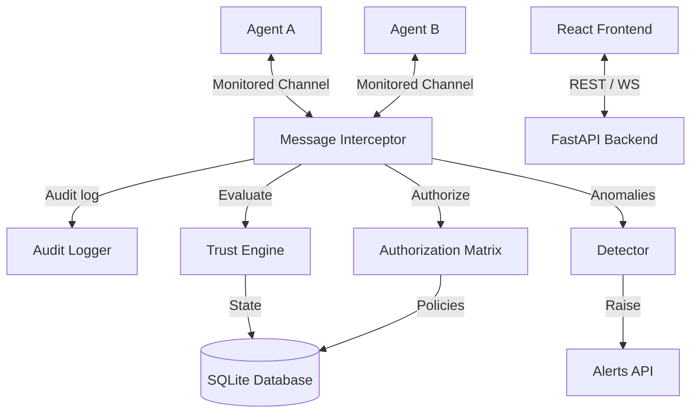

# AgentShield Architecture

AgentShield is a security gateway and monitoring platform designed for multi-agent systems. It intercepts agent communication, checks for authorization and policy violations, updates trust profiles dynamically, and issues alerts.

## Architecture Overview

## System Components

1. **Interceptor**: Hooks into the communication layer of agents to intercept all inbound/outbound messages.
2. **Detector**: Evaluates messages against known attack signatures (e.g., prompt injection, command execution, data exfiltration).
3. **Trust Engine**: Computes and maintains dynamic trust scores for each registered agent based on their historical behavior and interactions.
4. **Auth Matrix**: A role-based or attribute-based authorization matrix ensuring agents only execute approved commands and access authorized resources.
5. **Audit Logger**: Immutably records all messages, evaluations, alerts, and state changes.
