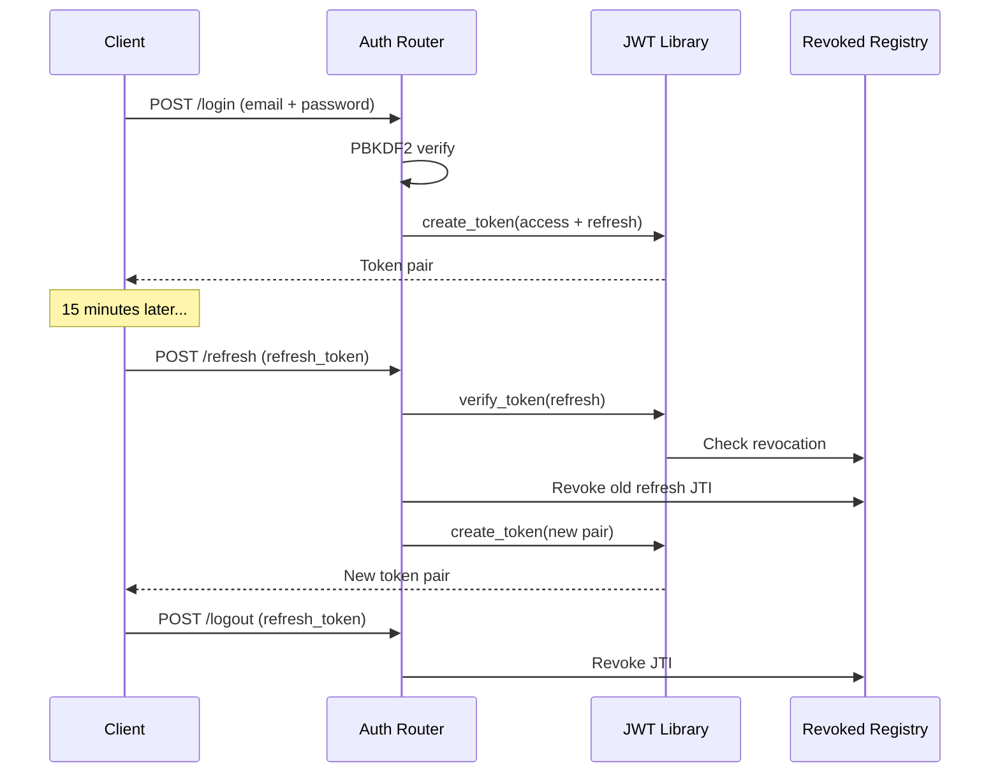

# Authentication

AgentShield implements a custom JWT authentication system with Role-Based Access Control.

---

## Overview

The authentication system is built entirely with Python standard library modules (`hmac`, `hashlib`, `base64`, `json`) — zero third-party cryptographic dependencies. This eliminates supply-chain risk from external JWT libraries.

---

## Components

| Component | File | Role |
|-----------|------|------|
| JWT Library | `utils/jwt.py` | Token signing, verification, revocation |
| Auth Router | `api/routers/auth.py` | Login, refresh, logout, user context endpoints |
| Auth Dependencies | `api/deps.py` | `get_current_user` and `require_roles` providers |

---

## Token Architecture

### Access Tokens
- **Algorithm:** HS256 (HMAC-SHA256)
- **Lifetime:** 15 minutes
- **Claims:** `sub` (email), `role`, `type` ("access"), `iat`, `exp`, `jti`
- **Usage:** Sent in `Authorization: Bearer` header for REST APIs

### Refresh Tokens
- **Algorithm:** HS256 (HMAC-SHA256)
- **Lifetime:** 7 days
- **Usage:** Sent in request body to `/auth/refresh` for token rotation

### Token Lifecycle



---

## Password Security

- **Algorithm:** PBKDF2-SHA256
- **Iterations:** 100,000
- **Salt:** 16 bytes random (generated per-user at startup)
- **Comparison:** Constant-time via `hmac.compare_digest()` to prevent timing attacks

---

## Role-Based Access Control

### Roles

| Role | Scope |
|------|-------|
| **Admin** | Full access to all endpoints and views |
| **Security Analyst** | Access to analysis, replay, dashboard, and fleet views |
| **Viewer** | Read-only access to dashboard and fleet status |

### Enforcement

RBAC is enforced server-side via the `require_roles()` dependency factory:

```python
@router.post("/analyze", dependencies=[Depends(require_roles("Admin", "Security Analyst"))])
```

The dependency:
1. Extracts the JWT from the Authorization header
2. Verifies signature, expiration, and revocation status
3. Checks the `role` claim against the allowed roles
4. Returns 401 (invalid token) or 403 (insufficient role)

---

## Security Protections

| Protection | Implementation |
|------------|---------------|
| Algorithm verification | Rejects tokens with `alg != "HS256"` (prevents `alg: none` bypass) |
| Constant-time signature check | `hmac.compare_digest()` prevents timing side-channel attacks |
| Token revocation | In-memory blacklist checked on every verification |
| Refresh rotation | Old refresh token revoked on each refresh (prevents replay) |
| Type checking | Access tokens rejected at refresh endpoint and vice versa |
| Expiration enforcement | `exp` claim validated against server time |

---

## WebSocket Authentication

WebSocket connections authenticate via query parameter:

```
ws://localhost:8000/api/v1/ws?token=eyJ...
```

The token is verified before the connection is accepted. Invalid or expired tokens result in immediate connection closure with code 1008 (Policy Violation).

---

## Extension Points

- **External IdP:** Replace static user database with OAuth2/OIDC provider
- **Rate limiting:** Add per-IP brute force protection on login endpoint
- **Token blacklist eviction:** Add TTL-based cleanup for the revoked token registry
- **Account lockout:** Lock accounts after N consecutive failed login attempts
