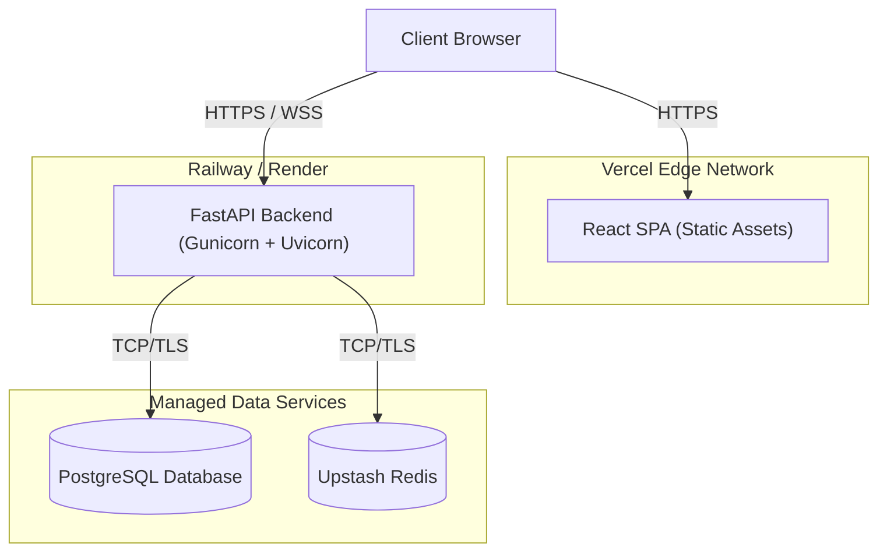

# AgentShield X — Production Deployment Guide

This guide covers deploying AgentShield X in a highly available, professional production environment using modern Platform-as-a-Service (PaaS) providers.

---

## Deployment Architecture

The recommended production architecture separates the frontend, backend, and data layers to maximize scalability and reliability.



### Component Breakdown
- **Frontend (Vercel):** Serves the compiled React static assets globally. Zero-maintenance, instant cache invalidation, and edge routing.
- **Backend (Railway/Render/Fly.io):** Hosts the FastAPI backend in a Docker container. Scales horizontally via stateless engines.
- **Database (PostgreSQL):** *[Architectural target]* Long-term persistence for trust profiles and replay sessions.
- **Redis (Upstash):** *[Architectural target]* Distributed state for rate limiting, sliding-window replay protection, and cross-worker WebSocket pub/sub.

---

## 1. Backend Deployment (Railway / Render)

### Preparation
The backend is fully containerized. The `backend/Dockerfile` uses a non-root user (`appuser`) and runs the application via `gunicorn` with `uvicorn` workers for maximum throughput.

### Environment Variables

| Variable | Required | Description |
|----------|----------|-------------|
| `APP_ENV` | Yes | **Must** be set to `production` |
| `SECRET_KEY` | Yes | 64+ byte secure random string (JWT signing key) |
| `CORS_ORIGIN_WHITELIST` | Yes | Comma-separated allowed origins (e.g., `https://agentshield.vercel.app`) |
| `DATABASE_URL` | Yes | Connection string for PostgreSQL |
| `REDIS_URL` | Optional | Connection string for Redis cache |

> **Security Note:** In `production` mode, the backend will refuse to start if `SECRET_KEY` is set to the default developer value.

### Deployment Steps (Railway)
1. Connect your GitHub repository to Railway.
2. Railway will automatically detect the `Dockerfile` at the root (ensure the root path is selected, as the Dockerfile uses the root context).
3. Add the required Environment Variables in the Railway dashboard.
4. Railway will build the container and deploy the service.

### Health and Readiness
The backend exposes `GET /api/v1/health`. Configure your PaaS to use this endpoint for liveness and readiness probes.
- **Path:** `/api/v1/health`
- **Expected Status:** `200 OK`

---

## 2. Frontend Deployment (Vercel)

Vercel is the ideal host for the React dashboard. It does not use Docker; it builds the Node application directly.

### Environment Variables

| Variable | Required | Description |
|----------|----------|-------------|
| `REACT_APP_API_URL` | Yes | The public HTTPS URL of your deployed backend |

### Deployment Steps (Vercel)
1. Import the GitHub repository into Vercel.
2. **Framework Preset:** Create React App
3. **Root Directory:** `frontend/`
4. Add the `REACT_APP_API_URL` environment variable.
5. Click **Deploy**. Vercel will automatically build and serve the static assets.

---

## 3. WebSocket Configuration

Real-time pipeline events are streamed via WebSockets at `/api/v1/ws`.

### Reverse Proxy Considerations
If you are deploying on a raw VPS using Nginx, you must configure Nginx to support protocol upgrading. Most PaaS providers (Railway, Render) support this out-of-the-box.

**Example Nginx Config:**
```nginx
location /api/v1/ws {
    proxy_pass http://backend:8000;
    proxy_http_version 1.1;
    proxy_set_header Upgrade $http_upgrade;
    proxy_set_header Connection "Upgrade";
    proxy_set_header Host $host;
    proxy_read_timeout 86400; # Prevent idle disconnections
}
```

---

## 4. Local Production Testing (Docker Compose)

You can test the exact production configuration locally using `docker-compose`.

```bash
# 1. Configure production variables
cp .env.example .env
# Edit .env and set a real SECRET_KEY and ensure APP_ENV=production

# 2. Build and run
docker-compose up --build -d
```

The `docker-compose.yml` provides stubs for PostgreSQL and Redis to emulate a complete production environment.

---

## 5. Production Pre-Flight Checklist

Before routing live traffic to AgentShield X, verify the following:

### Security
- [ ] `APP_ENV` is explicitly set to `production`.
- [ ] A cryptographically secure `SECRET_KEY` has been generated and set.
- [ ] `CORS_ORIGIN_WHITELIST` strictly allows only your Vercel frontend URL.
- [ ] Backend is running behind HTTPS (handled automatically by Vercel/Railway).

### Networking & Infrastructure
- [ ] Frontend `REACT_APP_API_URL` points to the correct backend domain.
- [ ] PaaS health checks are successfully probing `/api/v1/health`.
- [ ] WebSocket connections (`wss://`) establish successfully without timeout errors.

### Operations
- [ ] Production logs (stdout/stderr) are aggregated into a central logging tool (e.g., Datadog, Axiom, or native PaaS logs).
- [ ] Database backups are configured (if using managed PostgreSQL).
