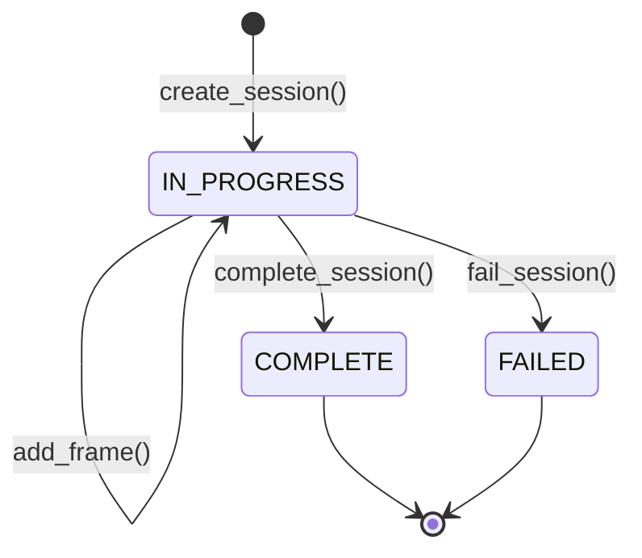

# Replay Engine

The Replay Engine provides full forensic reconstruction of every security interaction, enabling frame-by-frame incident investigation.

---

## Purpose

Answer: **"What exactly happened during this security interaction, step by step?"**

Every `POST /analyze` request generates a replayable session that captures the state at each pipeline stage.

---

## Design

### Architecture

```
Analysis Pipeline → TimelineBuilder → ReplaySession + Frames
                                              ↓
                        GET /replay/{session_id} → Ordered Timeline
```

### Key Components

| Component | File | Role |
|-----------|------|------|
| `ReplayEngine` | `core/replay/replay_engine.py` | Session lifecycle management |
| `TimelineBuilder` | `core/replay/timeline_builder.py` | Frame construction from engine outputs |
| `ReplaySession` | `core/replay/replay_models.py` | Container: metadata + ordered frames |
| `ReplayFrame` | `core/replay/replay_models.py` | Single stage snapshot |
| `ReplayStage` | `core/replay/replay_models.py` | Stage enum: RECEIVED, DETECTED, etc. |
| `SessionStatus` | `core/replay/replay_models.py` | Status enum: IN_PROGRESS, COMPLETE, FAILED |

---

## Data Flow

### Session Lifecycle



1. **Create:** A new session is opened when the analyze endpoint receives a request
2. **Record:** The TimelineBuilder creates a frame at each pipeline stage (RECEIVED, DETECTED, BEHAVIOR_ANALYZED, PROFILED, DECISION)
3. **Complete:** The session is finalized with the final decision and summary
4. **Query:** Sessions are retrievable via the REST API for investigation

### Frame Structure

Each frame captures:
- **Stage:** Which pipeline stage produced this frame
- **Timestamp:** When the stage completed
- **Title/Description:** Human-readable stage summary
- **Engine:** Which engine produced the result
- **Risk score:** Risk level at this stage
- **Trust score:** Trust level at this stage
- **Decision:** Security decision at this stage (if applicable)
- **Metadata:** Engine-specific detail data

---

## Key Algorithms

### Session Metrics

- **Duration:** Computed from first frame timestamp to session completion
- **Peak risk:** Highest risk score across all frames
- **Stages completed:** Ordered list of pipeline stages that ran

### Serialization

Sessions support full JSON round-tripping via `session_to_json()` and `session_from_json()` for export and archival.

---

## Extension Points

- **Persistent storage:** Replace in-memory session store with a database
- **TTL eviction:** Automatically expire sessions after a configurable retention period
- **SSE streaming:** Push frame updates in real-time via Server-Sent Events
- **Export:** Generate downloadable JSON/PDF reports per session
